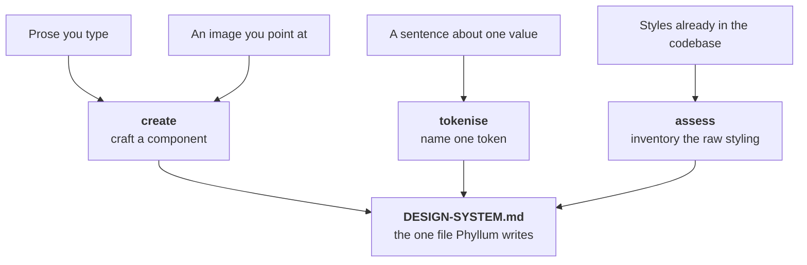

<div align="center"><pre>
   ___ _           _ _                 
  / _ \ |__  _   _| | |_   _ _ __ ___  
 / /_)/ '_ \| | | | | | | | | '_ ` _ \ 
/ ___/| | | | |_| | | | |_| | | | | | |
\/    |_| |_|\__, |_|_|\__,_|_| |_| |_|
             |___/                     
</pre></div>

<p align="center"><strong>A design system companion that turns prose, images, or the styles already in your codebase into named tokens and components, in one file.</strong></p>

<p align="center">
<a href="LICENSE.md"></a>


<a href="https://github.com/ndisisnd/phyllum/commits"></a>
</p>

<p align="center">
<a href="#what-it-is">What it is</a> ·
<a href="#install">Install</a> ·
<a href="#how-it-works">How it works</a> ·
<a href="#faq">FAQ</a> ·
<a href="llms.txt">llms.txt</a>
</p>

<p align="center"><sub>
<b>AI agents / LLMs:</b> read <a href="llms.txt"><code>llms.txt</code></a>.
</sub></p>

---

## What it is

Phyllum reads a codebase, or takes prose and images straight from you, and turns that
input into **tokens** and **components**. All of it lands in a single file:
`DESIGN-SYSTEM.md`. That file is human-readable Markdown with a fixed, machine-parseable
structure, and it is the only file in your codebase Phyllum ever writes.

Three ideas govern every command:

- **Rerunnable.** Running anything twice converges. Re-tokenising doesn't duplicate
  tokens; re-creating a component opens a revision of it.
- **Conversational, not form-driven.** When Phyllum is missing something, it asks a
  follow-up with a suggestion attached — never a blank required field.
- **One write target.** `DESIGN-SYSTEM.md` is the only file Phyllum touches, aside from
  its own gitignored `.phyllum/` — session state, and `apply`'s plan — and, on `init`, the
  skill install.

Two rules outrank being helpful. Phyllum never invents a value — a slot nobody filled is
a question or a `TODO`, never a plausible guess. And it never corrects a value — four
radii on one button or a 3px font gets recorded exactly as given. Phyllum governs *which*
slots must be filled, never *what* goes in them.

The commands:

| Command | What it does |
|---------|--------------|
| `create` | Craft a component from prose, an image you point at, or a pick from what your code repeats |
| `assess` | Read the codebase and inventory the raw styling already in it |
| `apply` | Plan applying the design system to the codebase — writes a PRD, runs nothing |
| `tokenise` | Name one token from a sentence, e.g. "our brand blue #2563EB" |
| `system` | Print the design system to the terminal |
| `gui` | Start a localhost dashboard for browsing tokens and components |
| `init` | Guided setup — scaffold the file, install the skill |
| `version` | Print the installed version and check npm for a newer one |
| `update` | Update this install to the latest published version |
| `menu` / `help` | List the commands, or explain one in depth |

## Install

Phyllum needs **Node 20 or newer** and has no dependencies to install. The intelligent
commands (`create`, `tokenise`) also want [Claude Code](https://www.claude.com/product/claude-code)
— they run natively inside a Claude Code session, or shell out to the `claude` CLI from a
plain terminal. The mechanical commands (`menu`, `help`, `system`, `assess`, `apply`,
`gui`, `version`, `update`, `init`) work without it. The `gui` dashboard uses your system
`python3`.

Install it globally:

```bash
npm install -g phyllum
```

Then, from inside the project you want a design system for, run the guided setup:

```bash
phyllum init
```

To check it's wired up, `phyllum menu` lists every command, and `phyllum help` prints an
overview. `init` scaffolds `DESIGN-SYSTEM.md` and installs the skill into
`.claude/skills/phyllum/` so it's available inside Claude Code too.

## How it works

Everything Phyllum learns — from prose, from an image, or from the code — flows through
three commands into one file. Which command reads what is the whole division of labour:
`assess` reads your codebase, `tokenise` reads the sentence you typed, `create` reads
your intent.



`create` runs in three modes. **Prose**: you describe a component and Phyllum drafts a
spec, lists the gaps the archetype contract still needs, and fills them through follow-up
questions. **Image**: you point at an image file; Phyllum traces it, turning confident
measurements into values and everything else into questions, and refuses to claim things a
still image can't show. **Pick**: bare `create` offers the archetypes plus the components
your codebase keeps repeating, and a pick seeds a name and an archetype — never values.

`assess` reads your codebase and tells you how much raw, un-systematised styling is in
there. Colours, lengths and typography are read out of *any* text file, whatever the
language — a theme file in JSON or Go counts as much as a `.css` file does — while
component detection reads React markup. Near-identical values (`#2563EB` and `#2564EC`,
`11px` and `12px`) cluster into one decision rather than two, usage is counted, and the
result is ranked by how hard your code leans on each value. The scan is strictly
read-only: nothing in your codebase is written, renamed or created. Run it again later
and anything your design system already names is reported as covered rather than
proposed again, so a rerun shows only what has drifted.

Three chained modes narrow the same scan. `assess tokens` walks the token suggestions
only; `assess components` walks the component suggestions only, one candidate at a time
with its own yes-or-no each; `assess update` skips the per-item review altogether and
accepts every proposed token under the name it showed you. `assess update` still refuses
to guess: a value it could see but not read stays unnamed, a component is never recorded
without its questions answered, and the only file it writes is `DESIGN-SYSTEM.md`.

`tokenise` names one value from one sentence: `phyllum tokenise "our brand blue #2563EB"`.
If the sentence names the token, that name is used; if not, Phyllum suggests one from the
naming scales and confirms it with you. It does not read your code — that's `assess`.

`apply` is the other direction: it takes the design system you have built and plans how to
get it into your code. Raw values become the tokens that already name them; ad-hoc patterns
become the components you recorded. **It plans it, and runs none of it.** `phyllum apply`
writes one file — `.phyllum/PRD.md` — where every single change has its own acceptance
criterion naming the file, the literal, what it becomes, and how to check it. Changes are
grouped into phases, and one phase is one future commit with its own verification: its
criteria, plus your project's own test suite when Phyllum can detect one. If your project
has an agent harness — a `CLAUDE.md`, an `AGENTS.md`, a Cursor or Windsurf config — the plan
is shaped so that harness can execute it natively; with none found, it is a plain plan
anybody can read. Everything Phyllum won't touch is listed with a reason: a literal no token
names, a length named for a different role, a component whose spec still says `TODO`. Re-run
`apply` any time and it resumes — your ticks, your completed phases and your notes survive,
while the change list is re-derived from scratch. `phyllum apply run` is what will execute
the plan, on its own branch, one commit per phase; it lands next.

Writes are atomic — Phyllum writes a temp file and renames it, so a crashed run can't
corrupt `DESIGN-SYSTEM.md`.

## How to update

Two different things:

- **Update Phyllum itself** — `phyllum version` tells you whether you are current, showing
  both your version and the latest published one. `phyllum update` then does the work: it
  detects how you installed Phyllum (npm or pnpm, globally or as a project dependency), runs
  the right command, and re-syncs the skill under `.claude/skills/phyllum/` so the CLI and
  the skill are never two versions. If it can't act safely — a one-off `npx` run has nothing
  to update, a source checkout belongs to git — it says so and prints the exact command to
  run instead. `version` is the only command that ever touches the network, and only when
  you ask: nothing checks for updates in the background.
- **Update what Phyllum produced** — re-run `assess`, `tokenise` or `create` any time. Because every
  command converges, a rerun refreshes `DESIGN-SYSTEM.md` without duplicating what's
  already there; `init` on an existing file adds back only missing sections and never drops
  your content.

## FAQ

**Does Phyllum write component code into my project?**
No. It writes the generated code into `DESIGN-SYSTEM.md` alongside the spec, and nowhere
else. It won't drop files into your source tree, rewrite existing styles to use tokens, or
touch config. If a task seems to need a write outside that one file, Phyllum stops and
tells you instead.

**What if I already have a `DESIGN-SYSTEM.md`?**
`init` won't overwrite it. It validates the section structure against the template and
offers to repair anything missing, adding headings back in their canonical position.
Nothing you wrote is dropped.

**Do I have to use Claude Code?**
For `create` and `tokenise`, yes — that's where the measuring and naming happen. If
`claude` isn't installed and you're not in a Claude Code session, those commands fail with
a message naming your two options. The mechanical commands keep working regardless, and
that includes `assess`: reading your codebase and aggregating what it finds is arithmetic,
so the scan runs in a plain terminal with nothing else installed.

**Does `assess` change my code?**
No. It reads. The modules that do the scanning contain no write call at all, and the test
suite diffs the entire directory around every scan and fails if one byte moved.

**Does `apply` change my code?**
Not today. `phyllum apply` writes a plan to `.phyllum/PRD.md` and nothing else — the test
suite diffs the whole project directory around every run and fails on a single other file.
`apply run` will be the first command allowed to write source, and only from a plan you have
read, only on its own branch, and only one commit per phase, stopping and reporting rather
than pressing on if a phase fails.

**Why is there a Python server for the GUI?**
`gui` serves a local dashboard over `python3` bound to localhost only, with a
PID-and-port lifecycle you stop with `phyllum kill`. It's not reachable from other
machines.

## License

[Apache-2.0](LICENSE.md)

## Acknowledgments

This README was generated with [mkpub](https://github.com/ndisisnd/mkpub).
