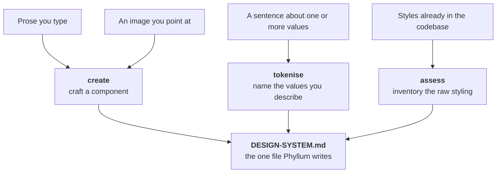

<div align="center"><pre>
   ___ _           _ _                 
  / _ \ |__  _   _| | |_   _ _ __ ___  
 / /_)/ '_ \| | | | | | | | | '_ ` _ \ 
/ ___/| | | | |_| | | | |_| | | | | | |
\/    |_| |_|\__, |_|_|\__,_|_| |_| |_|
             |___/                     
</pre></div>

<p align="center"><strong>A design system companion that turns prose, images, or the styles already in your codebase into named tokens and components, in one file.</strong></p>

<p align="center">
<a href="LICENSE.md"></a>


<a href="https://github.com/ndisisnd/phyllum/commits"></a>
</p>

<p align="center">
<a href="#what-it-is">What it is</a> ·
<a href="#install">Install</a> ·
<a href="#how-it-works">How it works</a> ·
<a href="#faq">FAQ</a> ·
<a href="llms.txt">llms.txt</a>
</p>

<p align="center"><sub>
<b>AI agents / LLMs:</b> read <a href="llms.txt"><code>llms.txt</code></a>.
</sub></p>

<!-- mkpub:release 0.3.0 -->
> [!NOTE]
> **🚀 New in 0.3.0 · Batch tokenise, primitive ramps, and a naming vocabulary**
>
> One `tokenise` sentence can now carry several values, name suggestions draw on a
> standard vocabulary, and `create primitives` lays down the colour ramps your tokens
> sit on. `update` now updates your codebase from the design system; updating Phyllum
> itself is `phyllum upgrade`.
> Update with `phyllum upgrade` · [Release notes](RELEASES.md)
<!-- /mkpub:release -->

---

## What it is

Phyllum reads a codebase, or takes prose and images straight from you, and turns that
input into **tokens** and **components**. All of it lands in a single file:
`DESIGN-SYSTEM.md`. That file is human-readable Markdown with a fixed, machine-parseable
structure, and it is the only file in your codebase Phyllum ever writes.

Three ideas govern every command:

- **Rerunnable.** Running anything twice converges. Re-tokenising doesn't duplicate
  tokens; re-creating a component opens a revision of it.
- **Conversational, not form-driven.** When Phyllum is missing something, it asks a
  follow-up with a suggestion attached — never a blank required field.
- **One write target.** `DESIGN-SYSTEM.md` is the only file Phyllum touches, aside from
  the `DESIGN-SYSTEM.md.bak` it leaves one undo behind, its own gitignored `.phyllum/` —
  session state, settings, and `apply`'s plan — and, on `init`, the skill install. Two
  things are allowed past that line, and only when you ask for them by name: `assess
  --json <path>` writes the `.json` file you typed, and `apply run` edits source, from a
  plan you have read, on a branch of its own, one phase at a time.

Two rules outrank being helpful. Phyllum never invents a value — a slot nobody filled is
a question or a `TODO`, never a plausible guess. And it never corrects a value — four
radii on one button or a 3px font gets recorded exactly as given. Phyllum governs *which*
slots must be filled, never *what* goes in them.

The commands:

| Command | What it does |
|---------|--------------|
| `create` | Craft a component from prose, an image you point at, or a pick from what your code repeats; `create primitives` lays down primitive colour ramps instead — wholly mechanical |
| `assess` | Read the codebase, map the raw styling already in it, and suggest tokens and components |
| `apply` | Plan applying the design system to the codebase; `apply run` executes the plan (`update` is the same command, kept as an alias) |
| `tokenise` | Name the values in a sentence, e.g. "our brand blue #2563EB" or "our overlay rgba(0, 0, 0, 0.5)" — several values are queued and asked about one at a time |
| `display` | Print the design system to the terminal (`system` is the same command, kept as an alias) |
| `gui` | Start the local server and open the dashboard for browsing tokens and components |
| `kill` | Stop the dashboard server `gui` started |
| `init` | Guided setup — scaffold the file, install the skill |
| `version` | Print the installed version and check npm for a newer one |
| `upgrade` | Upgrade this install to the latest published version |
| `menu` / `help` | List the commands, or explain one in depth |

## Install

Phyllum needs **Node 20 or newer** and has no dependencies to install.

Some commands are wholly mechanical and work on their own: `menu`, `help`, `display`,
`gui`, `kill`, `version`, `upgrade`, `create primitives` — shipped constants and
arithmetic, no model in the path — and `apply`, which only ever writes a plan.

Some want [Claude Code](https://www.claude.com/product/claude-code), and run natively
inside a Claude Code session or shell out to the `claude` CLI from a plain terminal.
`create` and `tokenise` need it for the whole of what they do. Three commands are split:
`assess` scans, maps and proposes names mechanically but needs it to review the
suggestions with you; `init` needs it to read your project and seed the file; and
`apply run` needs it for the criteria a substitution cannot settle. Every one of them
**degrades rather than failing** — it tells you what it could not do and stops, and
`apply run` still completes the criteria Node can do by itself.

The `gui` dashboard uses your system `python3`.

Install it globally:

```bash
npm install -g phyllum
```

Then, from inside the project you want a design system for, run the guided setup:

```bash
phyllum init
```

To check it's wired up, `phyllum menu` lists every command, and `phyllum help` prints an
overview. `init` scaffolds `DESIGN-SYSTEM.md` and installs the skill into
`.claude/skills/phyllum/` so it's available inside Claude Code too.

## How it works

Everything Phyllum learns — from prose, from an image, or from the code — flows through
three commands into one file. Which command reads what is the whole division of labour:
`assess` reads your codebase, `tokenise` reads the sentence you typed, `create` reads
your intent.



`create` runs in three modes. **Prose**: you describe a component and Phyllum drafts a
spec, lists the gaps the archetype contract still needs, and fills them through follow-up
questions. **Image**: you point at an image file; Phyllum traces it, turning confident
measurements into values and everything else into questions, and refuses to claim things a
still image can't show. **Pick**: bare `create` offers the archetypes plus the components
your codebase keeps repeating, and a pick seeds a name and an archetype — never values.

Fifteen archetypes ship with contracts — Button, Input, Card, Badge, Modal, Toggle,
Checkbox, Radio, Select, Tooltip, Toast, Tabs, Link, Avatar, Progress — and the picker's
last row is **custom**: a component that follows no contract at all. A custom has no
mandatory slots and no gap list; it records exactly what you describe, and it says so on
the page, so nothing downstream grades it against rules it never claimed.

`create primitives` is the odd one out: it writes no component at all. It lays down the
**primitive colour ramps** your semantic tokens sit on — nine steps, `100` (lightest) to
`900` (darkest), written under a `Primitives` heading inside the Colours table. With no
colour tokens recorded, you get the neutral grey ramp, which is nine constants Phyllum
ships and every install shares. With colour tokens recorded, you are asked about each one
in turn, and a yes derives that token's own ramp: its hue and saturation held, lightness
placed on a fixed scale, and **the value you recorded slotted in unchanged** at whichever
step it is nearest. Nothing is derived for a token you said no to, all nine values are
shown before you accept, and the same input gives the same ramp on every run and every
machine — there is no model anywhere in that path, which is why it works in a plain
terminal.

Names are the other half of that. Phyllum ships a **standard naming vocabulary** —
families like `neutral`, `interaction`, `success` and `danger`, ranks (`primary`,
`secondary`, `tertiary`), exception words like `subtle` and `inverse`, and state words
like `hover` and `pressed` — spelled in a fixed slot order, so `interaction-primary-hover`
is a name and `hover-interaction` is not. When your sentence says what a colour is *for*,
the suggestion comes from that vocabulary; when it doesn't, the older lightness-and-
saturation scales still answer. Either way it is only ever a suggestion, and **nothing you
already have is ever renamed**.

`assess` reads your codebase and tells you how much raw, un-systematised styling is in
there. Colours, lengths and typography are read out of text files in *any* language — a
theme file in JSON or Go counts as much as a `.css` file does — while component detection
reads React markup. The sweep is bounded on purpose: build output and dependency
directories, anything your `.gitignore` matches, files past a size cap, and files that
are not really text are skipped, and the report says how many files it read. Near-identical values (`#2563EB` and `#2564EC`,
`11px` and `12px`) cluster into one decision rather than two, usage is counted, and the
result is ranked by how hard your code leans on each value. The scan is strictly
read-only: nothing in your codebase is written, renamed or created. Run it again later
and anything your design system already names is reported as covered rather than
proposed again, so a rerun shows only what has drifted.

Three chained modes narrow the same scan. `assess tokens` walks the token suggestions
only; `assess components` walks the component suggestions only, one candidate at a time
with its own yes-or-no each; `assess update` skips the per-item review altogether and
accepts the proposed tokens the assessment graded as errors, under the names it showed
you. `assess update` still refuses to guess: a warning is reported and never accepted on
your behalf, a value it could see but not read stays unnamed, a component is never
recorded without its questions answered, and the only file it writes is `DESIGN-SYSTEM.md`.

The report ends in one number and one word: a **drift score** on a seven-step
Fibonacci scale (1, 2, 3, 5, 8, 13, 21 — lower is better) for how much
un-systematised styling is in there, and a **verdict** of `pass`,
`pass w/ warnings` or `fail` derived from the findings' severities. Both are
deterministic, so a rerun after a cleanup shows the number moving down the scale.
Add `--json` and the whole assessment — every finding, the similarity groups, the
score — is written to `.phyllum/assess.json` (or a path you name) instead of the
interactive report: same object, byte-stable between runs, easy to diff in CI.

And every command that edits `DESIGN-SYSTEM.md` copies it to
`DESIGN-SYSTEM.md.bak` first, so the state before the last edit is always on
disk. A backup that cannot be written stops the edit rather than proceeding
without it.

`tokenise` names the values in a sentence: `phyllum tokenise "our brand blue #2563EB"`.
Any colour format works — `phyllum tokenise "our overlay rgba(0, 0, 0, 0.5)"` — and the
value is recorded exactly as you typed it, while one colour written two ways is still
recognised as one colour.
A sentence carrying several — `phyllum tokenise "#2563EB #10B981 #F59E0B"` — becomes a
queue, walked one question at a time in the order you said them, and a value you skip
costs only itself. If the sentence names a token, that name is used; if not, Phyllum
suggests one — from the nomenclature vocabulary when your words say what a colour is for,
from the naming scales otherwise — and confirms it with you. It does not read your code —
that's `assess`.

`apply` is the other direction: it takes the design system you have built and plans how to
get it into your code. Raw values become the tokens that already name them; ad-hoc patterns
become the components you recorded. **It plans it, and runs none of it.** `phyllum apply`
writes one file — `.phyllum/PRD.md` — where every single change has its own acceptance
criterion naming the file, the literal, what it becomes, and how to check it. Changes are
grouped into phases, and one phase is one future commit with its own verification: its
criteria, plus your project's own test suite when Phyllum can detect one. If your project
has an agent harness — a `CLAUDE.md`, an `AGENTS.md`, a Cursor or Windsurf config — the plan
is shaped so that harness can execute it natively; with none found, it is a plain plan
anybody can read. Everything Phyllum won't touch is listed with a reason: a literal no token
names, a length named for a different role, a component whose spec still says `TODO`. Re-run
`apply` any time and it resumes — your ticks, your completed phases and your notes survive,
while the change list is re-derived from scratch.

`phyllum apply run` executes that plan — the one command that writes to your source files.
It re-checks the harness first: if your project has one, Phyllum hands the plan over with
precise instructions rather than driving somebody else's agent harness itself. With none
found, Phyllum orchestrates the run — a Fable orchestrator driving Opus 4.8 agents by
default, and whatever `.phyllum/config.json` says instead. Either way the same guarantees
hold. Work happens on a `phyllum/apply-<date>` branch created from wherever you were
standing, so **the branch you are on is never written to**. Each phase lands as its own
commit containing only the files that phase's criteria name. Exact literals on the
properties a criterion names are replaced mechanically in Node, and the report says which
criteria went that way and which went to an agent — with no model reachable, mechanical
phases still land and the rest stop and say which model they needed. A phase commits only
when its criteria verify by reading the file, its diff stays inside those files, and your
own test suite is green. A failing phase stops the run, keeps the completed commits, and
records where it stopped in the plan; the next `apply run` resumes from there. Nothing is
ever rolled back. You get a status report every five minutes while it works.

`gui` opens a local dashboard onto the same file, and it **shows the values rather than
printing them**: every colour token is a filled swatch of that colour, with a border where
a near-white would otherwise vanish against the page; a primitives ramp is a nine-step
strip; typography tokens render as live specimens in their own size, weight and
line-height; and numbers render as measured bars. The page is styled along Carbon Design
System lines — flat tiles, sharp corners, a disciplined type ramp — but it takes no
dependency on Carbon or anything else: the stylesheet is hand-written in the one file and
the page fetches nothing from the network. It stays read-only, on localhost only. Writing
is the CLI's job.

Writes are atomic — Phyllum writes a temp file and renames it, so a crashed run can't
corrupt `DESIGN-SYSTEM.md`.

## How to update

Three different things, and from 0.3.0 each has its own word:

- **Update Phyllum itself — `phyllum upgrade`** — `phyllum version` tells you whether you
  are current, showing both your version and the latest published one. `phyllum upgrade`
  then does the work: it detects how you installed Phyllum (npm or pnpm, globally or as a
  project dependency), runs the right command, and re-syncs the skill under
  `.claude/skills/phyllum/` so the CLI and the skill are never two versions. If it can't
  act safely — a one-off `npx` run has nothing to update, a source checkout belongs to git
  — it says so and prints the exact command to run instead. `version` is the only command
  that ever touches the network, and only when you ask: nothing checks for updates in the
  background. Up to 0.2.3 this command was called `phyllum update`; only the word changed.
- **Update what Phyllum produced** — re-run `assess`, `tokenise` or `create` any time. Because every
  command converges, a rerun refreshes `DESIGN-SYSTEM.md` without duplicating what's
  already there; `init` on an existing file adds back only missing sections and never drops
  your content.
- **Update your codebase from the design system — `phyllum apply`** — it writes the plan to
  `.phyllum/PRD.md` and runs nothing; `apply run` executes it. In 0.3.0 only, `phyllum update`
  was a second name for this; from 0.4.0 `apply` stands alone under its own name.
- **Change what the design system records — `phyllum update`** — the editing verb from 0.4.0.
  `phyllum update` opens a menu, `update token` walks type → list → pick → a sentence
  describing the change, and prose straight in reads its target from the sentence. A rename
  rewrites every spec slot and Backlog line naming the old token in the same write; nothing
  is written until you accept.

## FAQ

**Does Phyllum write component code into my project?**
No. It writes the generated code into `DESIGN-SYSTEM.md` alongside the spec, and nowhere
else. It won't drop files into your source tree, rewrite existing styles to use tokens, or
touch config. If a task seems to need a write outside that one file, Phyllum stops and
tells you instead.

**What if I already have a `DESIGN-SYSTEM.md`?**
`init` won't overwrite it. It validates the section structure against the template and
offers to repair anything missing, adding headings back in their canonical position.
Nothing you wrote is dropped.

**Do I have to use Claude Code?**
For `create` and `tokenise`, yes — that's where the measuring and naming happen. If
`claude` isn't installed and you're not in a Claude Code session, those commands fail with
a message naming your two options. The mechanical commands keep working regardless, and
that includes `assess`: reading your codebase and aggregating what it finds is arithmetic,
so the scan runs in a plain terminal with nothing else installed.

**Does `assess` change my code?**
No. It reads. The modules that do the scanning contain no write call at all, and the test
suite diffs the entire directory around every scan and fails if one byte moved.

**Does `apply` change my code?**
`phyllum apply` does not. It writes a plan to `.phyllum/PRD.md` and nothing else — the test
suite diffs the whole project directory around every run and fails on a single other file.
`phyllum apply run` is the one command allowed to write source, and only from that plan:
only on a `phyllum/apply-<date>` branch of its own, only the files the running phase's
criteria name, one commit per phase, stopping and reporting rather than pressing on when a
phase fails. Nothing it does is ever rolled back automatically — a stopped run keeps its
branch and its commits, and tells you where it stopped.

**What stops `apply run` from editing a file it was not asked to?**
The permission model, not good intentions. A phase opens a *grant* naming its branch and its
own file list, and every write re-checks both — the wrong branch, a file outside the phase,
or a closed grant is refused, and nothing else in Phyllum can open a grant at all. The
assertion suite asserts each of those refusals, and an edit that lands outside the phase's
criteria stops the phase instead of being committed.

**Why is there a Python server for the GUI?**
`gui` serves a local dashboard over `python3` bound to localhost only, with a
PID-and-port lifecycle you stop with `phyllum kill`. It's not reachable from other
machines.

## License

[Apache-2.0](LICENSE.md)

## Acknowledgments

This README was generated with [mkpub](https://github.com/ndisisnd/mkpub).
