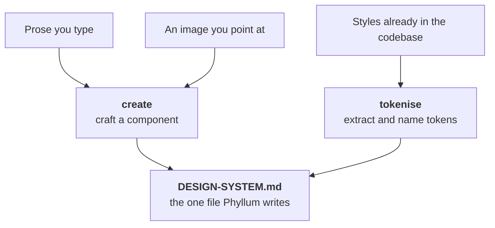

<div align="center"><pre>
   ___ _           _ _                 
  / _ \ |__  _   _| | |_   _ _ __ ___  
 / /_)/ '_ \| | | | | | | | | '_ ` _ \ 
/ ___/| | | | |_| | | | |_| | | | | | |
\/    |_| |_|\__, |_|_|\__,_|_| |_| |_|
             |___/                     
</pre></div>

<p align="center"><strong>A design system companion that turns prose, images, or the styles already in your codebase into named tokens and components, in one file.</strong></p>

<p align="center">
<a href="LICENSE.md"></a>


<a href="https://github.com/ndisisnd/phyllum/commits"></a>
</p>

<p align="center">
<a href="#what-it-is">What it is</a> ·
<a href="#install">Install</a> ·
<a href="#how-it-works">How it works</a> ·
<a href="#faq">FAQ</a> ·
<a href="llms.txt">llms.txt</a>
</p>

<p align="center"><sub>
<b>AI agents / LLMs:</b> read <a href="llms.txt"><code>llms.txt</code></a>.
</sub></p>

---

## What it is

Phyllum reads a codebase, or takes prose and images straight from you, and turns that
input into **tokens** and **components**. All of it lands in a single file:
`DESIGN-SYSTEM.md`. That file is human-readable Markdown with a fixed, machine-parseable
structure, and it is the only file in your codebase Phyllum ever writes.

Three ideas govern every command:

- **Rerunnable.** Running anything twice converges. Re-tokenising doesn't duplicate
  tokens; re-creating a component opens a revision of it.
- **Conversational, not form-driven.** When Phyllum is missing something, it asks a
  follow-up with a suggestion attached — never a blank required field.
- **One write target.** `DESIGN-SYSTEM.md` is the only file Phyllum touches, aside from
  its own gitignored session state and, on `init`, the skill install.

Two rules outrank being helpful. Phyllum never invents a value — a slot nobody filled is
a question or a `TODO`, never a plausible guess. And it never corrects a value — four
radii on one button or a 3px font gets recorded exactly as given. Phyllum governs *which*
slots must be filled, never *what* goes in them.

The commands:

| Command | What it does |
|---------|--------------|
| `create` | Craft a component from prose, an image you point at, or a pick from what your code repeats |
| `tokenise` | Extract and name tokens from the styles already in the codebase |
| `system` | Print the design system to the terminal |
| `gui` | Start a localhost dashboard for browsing tokens and components |
| `init` | Guided setup — scaffold the file, install the skill |
| `menu` / `help` | List the commands, or explain one in depth |

## Install

Phyllum needs **Node 20 or newer** and has no dependencies to install. The intelligent
commands (`create`, `tokenise`) also want [Claude Code](https://www.claude.com/product/claude-code)
— they run natively inside a Claude Code session, or shell out to the `claude` CLI from a
plain terminal. The mechanical commands (`menu`, `help`, `system`, `gui`, `init`) work
without it. The `gui` dashboard uses your system `python3`.

Install it globally:

```bash
npm install -g phyllum
```

Then, from inside the project you want a design system for, run the guided setup:

```bash
phyllum init
```

To check it's wired up, `phyllum menu` lists every command, and `phyllum help` prints an
overview. `init` scaffolds `DESIGN-SYSTEM.md` and installs the skill into
`.claude/skills/phyllum/` so it's available inside Claude Code too.

## How it works

Everything Phyllum learns — from prose, from an image, or from the code — flows through
`create` and `tokenise` into one file.



`create` runs in three modes. **Prose**: you describe a component and Phyllum drafts a
spec, lists the gaps the archetype contract still needs, and fills them through follow-up
questions. **Image**: you point at an image file; Phyllum traces it, turning confident
measurements into values and everything else into questions, and refuses to claim things a
still image can't show. **Pick**: bare `create` offers the archetypes plus the components
your codebase keeps repeating, and a pick seeds a name and an archetype — never values.

`tokenise` reads the styles already in your code, runs three passes, clusters raw values
before naming them, and shows you a frequency-ranked review before anything is written. Run
it again later and it shows a diff rather than re-adding what's already there.

Writes are atomic — Phyllum writes a temp file and renames it, so a crashed run can't
corrupt `DESIGN-SYSTEM.md`.

## How to update

Two different things:

- **Update Phyllum itself** — `npm install -g phyllum@latest`, then re-run `phyllum init`
  in your project to refresh the installed skill under `.claude/skills/phyllum/`. The skill
  files are Phyllum-owned, so they're safe to rewrite.
- **Update what Phyllum produced** — re-run `tokenise` or `create` any time. Because every
  command converges, a rerun refreshes `DESIGN-SYSTEM.md` without duplicating what's
  already there; `init` on an existing file adds back only missing sections and never drops
  your content.

## FAQ

**Does Phyllum write component code into my project?**
No. It writes the generated code into `DESIGN-SYSTEM.md` alongside the spec, and nowhere
else. It won't drop files into your source tree, rewrite existing styles to use tokens, or
touch config. If a task seems to need a write outside that one file, Phyllum stops and
tells you instead.

**What if I already have a `DESIGN-SYSTEM.md`?**
`init` won't overwrite it. It validates the section structure against the template and
offers to repair anything missing, adding headings back in their canonical position.
Nothing you wrote is dropped.

**Do I have to use Claude Code?**
For `create` and `tokenise`, yes — that's where the measuring and naming happen. If
`claude` isn't installed and you're not in a Claude Code session, those commands fail with
a message naming your two options. The mechanical commands keep working regardless.

**Why is there a Python server for the GUI?**
`gui` serves a local dashboard over `python3` bound to localhost only, with a
PID-and-port lifecycle you stop with `phyllum kill`. It's not reachable from other
machines.

## License

[Apache-2.0](LICENSE.md)

## Acknowledgments

This README was generated with [mkpub](https://github.com/ndisisnd/mkpub).
